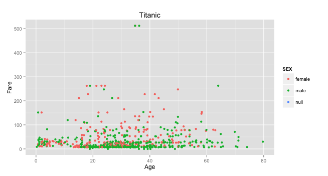
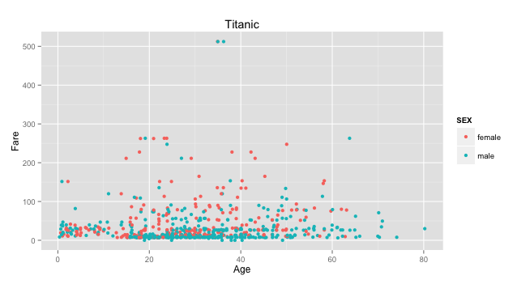
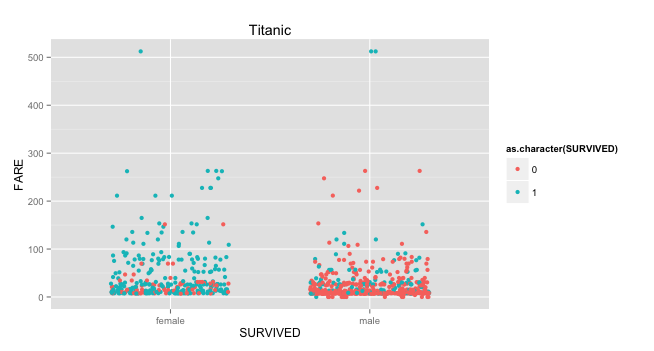
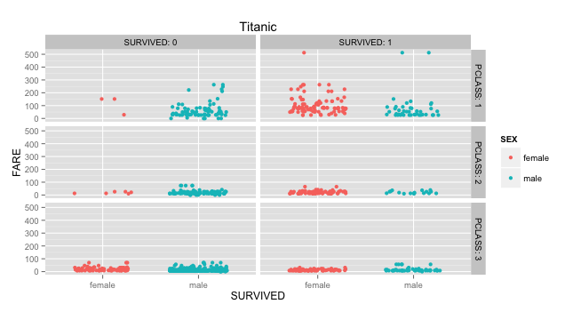
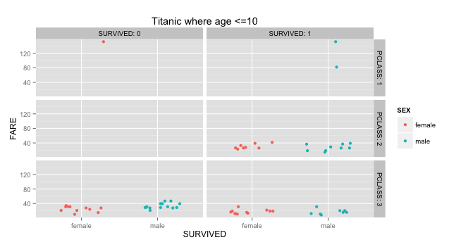
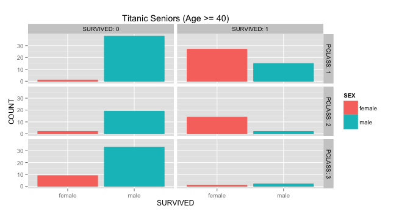

**Authors: Rolando Melendez, Hyunji Seo, Catherine Tu**

###This is how our RStudio is configured:
```{r}
sessionInfo()
```

```{r}
#Shows the subset and summary of the data frame
source("../01 Data/TitanicData.R", echo = TRUE)
```

***

###Visualization 1


```{r}
#source("../02 Visualizations/TitanicVisualization_1.R", echo = TRUE)
#Not sure if this is really needed?? gives html messy look with errors at end Can we just give more explanation in the method section? 
```

####**Method: **
In Visualization 1, We compared data based on Age and Fare between males, females, and null values. We copied the data frame into a new local data frame, set x and y as continuous, followed by giving them their corresponding labels. The layer in this visualization set the axis; x with age values and y with fare values. It is a point plot that graphs the people's age and corresponding fares in the x/y axis repectively, and the legend is seperated and colored by sex.

####**Findings: **
There did not seem to be a real trend between Age and Fare. Most people in general payed the lower fares regardless of age. Few of them payed in the mid-range, and a few seemed like outliers paying in the highest range.

***

###Visualization 2


```{r}
#source("../02 Visualizations/TitanicVisualization_2.R", echo = TRUE)
#Not sure if this is really needed?? gives html messy look with errors at end Can we just give more explanation in the method section? 
```

####**Method: **
In Visualization 2, Like in Visualization 1 we compared data based on Age and Fare between males, females, but not null values this time. We copied the data frame into a new local data frame, set x and y as continuous, followed by giving them their corresponding labels. The layer in this visualization set the axis; x with age values and y with fare values. It is a point plot that graphs the people's age and corresponding fares in the x/y axis repectively, and the legend is seperated and colored by sex.

####**Findings: **
Again there did not seem to be a real trend between Age and Fare. Most people in general payed the lower fares regardless of age. Few of them payed in the mid-range, and a few seemed like outliers paying in the highest range.

***

###Visualization 3


```{r}
#source("../02 Visualizations/TitanicVisualization_3.R", echo = TRUE)
```

####**Method: **


####**Findings: **

***

###Visualization 4


```{r}
#source("../02 Visualizations/TitanicVisualization_4.R", echo = TRUE)
```

####**Method: **


####**Findings: **

***

###Visualization 5


```{r}
#source("../02 Visualizations/TitanicVisualization_5.R", echo = TRUE)
```

####**Method: **


####**Findings: **

***

###Visualization 6


```{r}
#source("../02 Visualizations/TitanicVisualization_6.R", echo = TRUE)
```

####**Method: **


####**Findings: **

